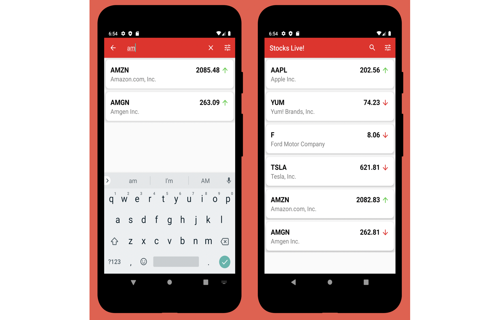

# Stocks-Live-App

Technology Stack:

•	MVVM Architecture: ViewModel, Repository, Event Structure

•	Google Architecture Components - ViewModel, LiveData

•	Communicating with a Yum WebSocket API using OkHttp WebSocket Client

•	Communicating with a Yum Rest API using Retrofit2

•	Singleton Software Design Pattern.

•	Executors, Background Threads and ThreadPools
